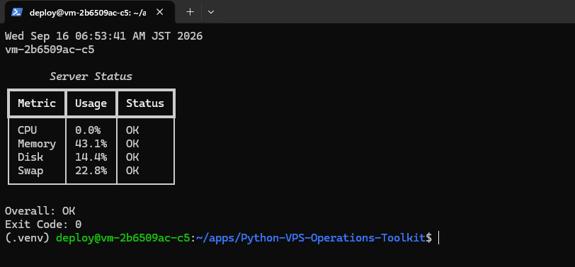
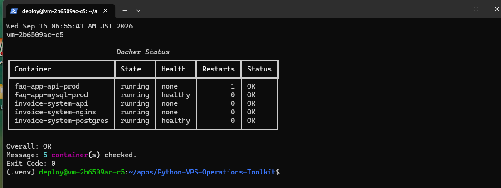
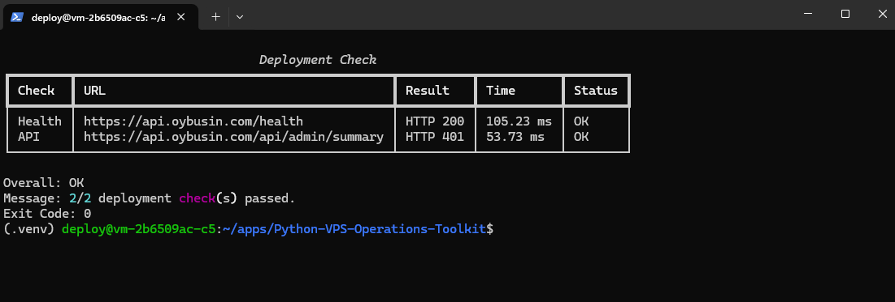
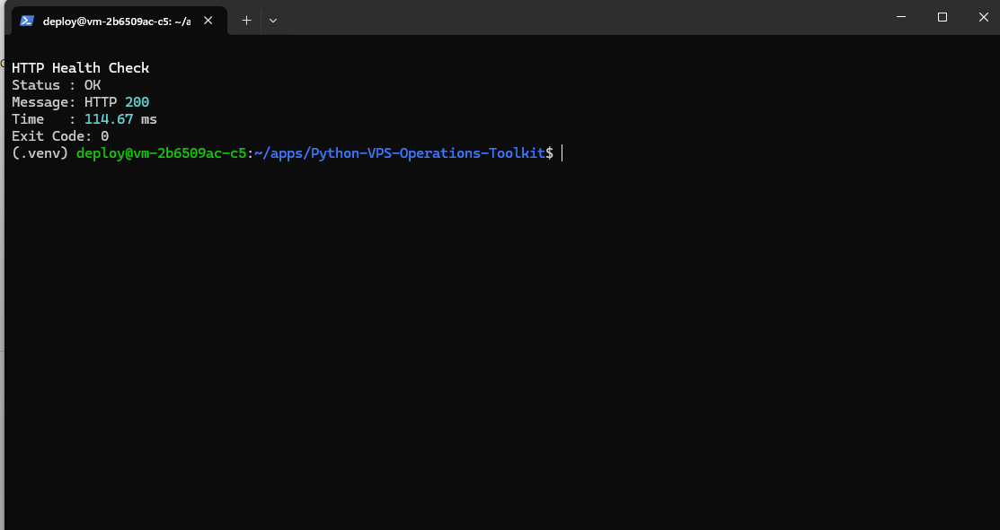
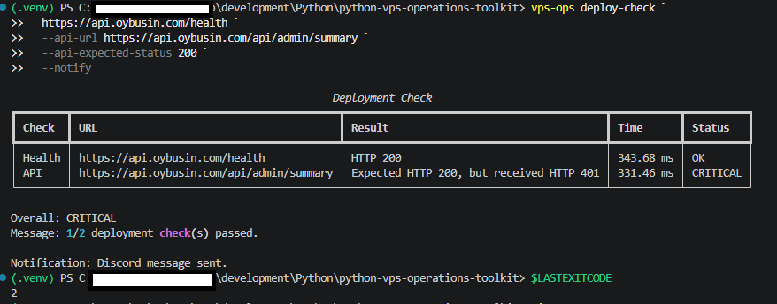
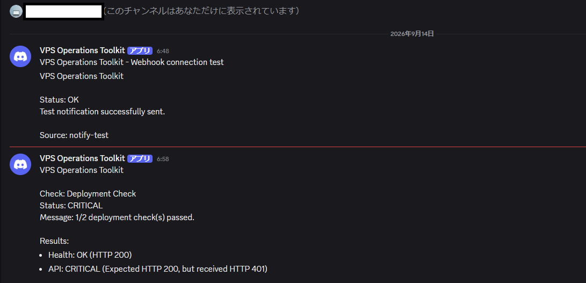

# Python VPS Operations Toolkit

VPS / Docker 環境の監視・異常検知・デプロイ確認を自動化する、
Python 製の CLI 運用支援ツールです。

HTTP ヘルスチェック、サーバーリソース監視、Docker コンテナ監視、
TLS 証明書期限監視、ログ解析、デプロイ後確認、Discord Webhook 通知を
1つの CLI から実行できます。

実際の VPS / Docker 環境を運用する中で、

- `curl` によるヘルスチェック
- `docker compose ps` によるコンテナ確認
- CPU / Memory / Disk / Swap の確認
- TLS 証明書期限の確認
- ERROR / WARN ログの確認
- デプロイ後の API 疎通確認

などを個別に手作業で行っていたため、
これらを Python CLI として共通化・自動化する目的で開発しました。

---

## Screenshots / Operation Evidence

実装した CLI を **実際の ConoHa VPS（Ubuntu 24.04.4 LTS / Python 3.12.3）** と公開 API で動作確認したエビデンスです。
監視結果の表示だけでなく、実 Docker コンテナの状態取得、期待 HTTP ステータスとの比較、Exit Code、Discord Webhook 通知まで確認しています。

### VPS Server Resource Monitoring



VPS 上で `vps-ops server` を実行し、CPU / Memory / Disk / Swap を取得しています。
各項目は `OK`、`Overall: OK`、`Exit Code: 0` となり、実 VPS 上でサーバー監視が動作することを確認しています。

### VPS Docker Monitor



同一 VPS 上で稼働する FAQ 系・Invoice 系の Docker コンテナを一括確認しています。
5 コンテナすべてが `running`、DB コンテナは `healthy`、`Overall: OK`、`Exit Code: 0` となることを確認しています。

### Invoice Deployment Check - Expected Status Match



Invoice API の Health Endpoint は HTTP 200、認証必須 API は期待値 HTTP 401 として確認しています。
実際のレスポンスと一致し、`2/2 deployment check(s) passed.`、`Overall: OK`、`Exit Code: 0` となることを確認しています。

### FAQ HTTP Health Check



FAQ API の公開 Health Endpoint に対して HTTP 200 を確認し、`Status: OK`、`Exit Code: 0` となることを確認しています。

### Deployment Check - Failure Detection and Discord Notification



異常検知・通知の確認用として、認証必須 API に対する期待値を意図的に HTTP 200 とし、実際の HTTP 401 との差分を発生させています。
`CRITICAL` と判定して Discord へ通知し、監視結果の `Exit Code: 2` を維持することを確認しています。

### Discord Critical Alert



`deploy-check --notify` による異常検知結果が Discord の通知先へ送信された例です。
Webhook URL などの秘密情報は画像・リポジトリには含めません。

---

## Features

### HTTP Health Check

HTTP エンドポイントへアクセスし、

- HTTP Status Code
- Response Time
- Timeout
- Connection Error
- Expected Status

を確認します。

```powershell
vps-ops health https://api.example.com/health
```

実行例:

```
HTTP Health Check
Status : OK
Message: HTTP 200
Time   : 370.24 ms
```

### Server Monitor

サーバーのリソース使用率を監視します。

- CPU
- Memory
- Disk
- Swap

```powershell
vps-ops server
```

実行例:

```
       Server Status
┏━━━━━━━━┳━━━━━━━┳━━━━━━━━━┓
┃ Metric ┃ Usage ┃ Status  ┃
┡━━━━━━━━╇━━━━━━━╇━━━━━━━━━┩
│ CPU    │ 8.2%  │ OK      │
│ Memory │ 35.8% │ OK      │
│ Disk   │ 84.9% │ WARNING │
│ Swap   │ 2.5%  │ OK      │
└────────┴───────┴─────────┘

Overall: WARNING
```

デフォルト閾値:

| Usage | Status |
|---|---|
| < 80% | OK |
| 80% - 89.9% | WARNING |
| >= 90% | CRITICAL |

閾値は変更できます。

```powershell
vps-ops server --warning 70 --critical 85
```

> `server` はコマンドを実行しているマシン自身を監視します。
> VPS 上で実行した場合は VPS の CPU / Memory / Disk / Swap が対象になります。

### Docker Monitor

Docker Engine に接続し、コンテナ状態を確認します。

- running / exited
- healthy / unhealthy / starting
- RestartCount
- Docker Engine connection error
- Overall status

```powershell
vps-ops docker
```

実行例:

```
                             Docker Status
┏━━━━━━━━━━━━━━━━━━━━━━━━━┳━━━━━━━━━┳━━━━━━━━━┳━━━━━━━━━━┳━━━━━━━━┓
┃ Container               ┃ State   ┃ Health  ┃ Restarts ┃ Status ┃
┡━━━━━━━━━━━━━━━━━━━━━━━━━╇━━━━━━━━━╇━━━━━━━━━╇━━━━━━━━━━╇━━━━━━━━┩
│ invoice-system-api      │ running │ none    │        0 │ OK     │
│ invoice-system-nginx    │ running │ none    │        2 │ OK     │
│ invoice-system-postgres │ running │ healthy │        0 │ OK     │
└─────────────────────────┴─────────┴─────────┴──────────┴────────┘

Overall: OK
```

判定例:

| Container State | Health | Status |
|---|---|---|
| running | healthy | OK |
| running | none | OK |
| running | starting | WARNING |
| running | unhealthy | CRITICAL |
| exited | - | CRITICAL |

### TLS Certificate Monitor

TLS 接続を行い、証明書の有効期限を監視します。

```powershell
vps-ops tls api.example.com
```

実行例:

```
TLS Certificate Status
Host      : api.example.com
Port      : 443
Expires   : 2026-11-24 20:35:42 UTC
Days Left : 74
Status    : OK
Message   : TLS certificate is valid for 74 more day(s).
```

デフォルト閾値:

| Remaining Days | Status |
|---|---|
| > 30 days | OK |
| 15 - 30 days | WARNING |
| <= 14 days | CRITICAL |

閾値は変更可能です。

```powershell
vps-ops tls api.example.com `
  --warning-days 60 `
  --critical-days 30
```

Python 標準ライブラリの `ssl` / `socket` を使用し、
証明書チェーン・ホスト名検証を行います。

### Log Monitor

ログファイルの最近の行を解析し、ERROR / WARNING を検出します。

```powershell
vps-ops logs ./logs/app.log
```

実行例:

```
Log Status
Path      : logs/app.log
Scanned   : 6 line(s)
Errors    : 1
Warnings  : 1
Overall   : CRITICAL
Message   : 1 error(s) and 1 warning(s) found.

Recent Matches
┏━━━━━━┳━━━━━━━━━┳━━━━━━━━━━━━━━━━━━━━━━━━━━━━━━━━━━━━━━━━━━━━━━━━━━━━━━┓
┃ Line ┃ Level   ┃ Log                                                  ┃
┡━━━━━━╇━━━━━━━━━╇━━━━━━━━━━━━━━━━━━━━━━━━━━━━━━━━━━━━━━━━━━━━━━━━━━━━━━┩
│    3 │ WARNING │ 2026-09-11 07:02:00 WARN Response time is high       │
│    5 │ ERROR   │ 2026-09-11 07:04:00 ERROR Database connection failed │
└──────┴─────────┴──────────────────────────────────────────────────────┘
```

以下の形式を検出します。

- `ERROR`
- `ERR`
- `FATAL`
- `CRITICAL`
- `FAILED`
- `WARN`
- `WARNING`
- `nginx [error]`
- `nginx [warn]`
- `nginx [crit]`
- `nginx [alert]`
- `nginx [emerg]`

直近の解析対象行数・表示件数も変更できます。

```powershell
vps-ops logs ./logs/app.log `
  --tail-lines 2000 `
  --max-matches 50
```

### Deployment Check

デプロイ後に複数の HTTP エンドポイントをまとめて確認します。

```powershell
vps-ops deploy-check https://api.example.com/health
```

API エンドポイントも追加できます。

```powershell
vps-ops deploy-check `
  https://api.example.com/health `
  --api-url https://api.example.com/swagger/index.html
```

実行例:

```
Deployment Check

Health  HTTP 200  OK
API     HTTP 200  OK

Overall: OK
Message: 2/2 deployment check(s) passed.
```

認証が必要な API では、401 を期待値として指定することもできます。

```powershell
vps-ops deploy-check `
  https://api.example.com/health `
  --api-url https://api.example.com/api/admin/summary `
  --api-expected-status 401
```

これにより、

```
Expected: HTTP 401
Actual:   HTTP 401
Status:   OK
```

として判定できます。

### Discord Notification

Discord Webhook を利用して異常検知結果を通知できます。

Webhook URL はコードへ保存せず、環境変数から取得します。

**Environment Variable**

PowerShell:

```powershell
$env:VPS_OPS_DISCORD_WEBHOOK_URL="YOUR_DISCORD_WEBHOOK_URL"
```

Linux / Bash:

```bash
export VPS_OPS_DISCORD_WEBHOOK_URL="YOUR_DISCORD_WEBHOOK_URL"
```

`.env.example` は必要な環境変数名を示す公開用テンプレートです。
現在の実装は環境変数を直接参照するため、`.env` ファイルの自動読み込みは行いません。

Webhook URL が設定されていることだけ確認する場合:

```powershell
Test-Path Env:VPS_OPS_DISCORD_WEBHOOK_URL
# True
```

> Webhook URL は秘密情報のため Git リポジトリには保存しません。

**Notification Test**

Discord への接続確認:

```powershell
vps-ops notify-test
```

成功例:

```
Discord Notification
Status : OK
Message: Discord notification sent successfully.
HTTP   : 204
```

**Deployment Alert**

`deploy-check` に `--notify` を追加すると、
異常発生時に Discord へ通知します。

```powershell
vps-ops deploy-check `
  https://api.example.com/health `
  --api-url https://api.example.com/api/admin/summary `
  --api-expected-status 200 `
  --notify
```

例えば API が期待値 200 に対して 401 を返した場合:

```
Health : OK
API    : CRITICAL

Overall: CRITICAL
Message: 1/2 deployment check(s) passed.

Notification: Discord message sent.
```

Discord:

```
VPS Operations Toolkit

Check: Deployment Check
Status: CRITICAL
Message: 1/2 deployment check(s) passed.

Results:
- Health: OK (HTTP 200)
- API: CRITICAL (Expected HTTP 200, but received HTTP 401)
```

正常時は通知を送信しません。

```
Overall: OK

Notification: skipped (deployment status is OK).
```

通知失敗時でも、本来の監視結果の Exit Code は維持します。

例:

```
Deployment Check : CRITICAL
Discord          : ERROR
Exit Code        : 2
```

通知システムの障害によって、監視対象の異常状態が隠れないようにしています。

---

## Exit Codes

各コマンドは、シェル・CI/CD・デプロイスクリプトから利用できるよう
終了コードを返します。

| Exit Code | Status | Meaning |
|---|---|---|
| 0 | OK | 正常 |
| 1 | WARNING | 注意が必要 |
| 2 | CRITICAL | 異常 |
| 3 | ERROR | チェック処理自体の失敗 |

PowerShell:

```powershell
vps-ops health https://api.example.com/health

$LASTEXITCODE
# 0
```

この仕組みにより、CI/CD やシェルスクリプトからも監視結果を判定できます。

---

## CLI Commands

```
vps-ops
│
├─ health
│  └─ HTTP Health Check
│
├─ server
│  ├─ CPU
│  ├─ Memory
│  ├─ Disk
│  └─ Swap
│
├─ docker
│  ├─ Container State
│  ├─ Health
│  └─ RestartCount
│
├─ tls
│  └─ TLS Certificate Expiration
│
├─ logs
│  └─ ERROR / WARNING Detection
│
├─ deploy-check
│  ├─ Health Endpoint
│  ├─ API Endpoint
│  └─ Discord Alert
│
└─ notify-test
   └─ Discord Webhook Test
```

コマンド一覧:

```powershell
vps-ops --help
```

---

## Architecture

```
                 Python VPS Operations Toolkit
                            │
          ┌─────────────────┼─────────────────┐
          │                 │                 │
       Monitoring       Deployment       Notification
          │                 │                 │
          │                 │                 └─ Discord Webhook
          │                 │
          │                 ├─ Health Endpoint
          │                 └─ API Endpoint
          │
          ├─ HTTP
          ├─ Server
          ├─ Docker
          ├─ TLS
          └─ Logs
                            │
                            ▼
                     CheckStatus
              OK / WARNING / CRITICAL / ERROR
                            │
                            ▼
                       Exit Code
                     0 / 1 / 2 / 3
```

監視処理と通知処理を分離し、

- `checks/` は「状態を調べる責務」
- `notifications/` は「外部へ通知する責務」

として構成しています。

---

## Project Structure

```
python-vps-operations-toolkit/
│
├─ src/
│  └─ vps_ops_toolkit/
│     ├─ checks/
│     │  ├─ deployment_check.py
│     │  ├─ docker_check.py
│     │  ├─ http_check.py
│     │  ├─ log_check.py
│     │  ├─ server_check.py
│     │  └─ tls_check.py
│     │
│     ├─ notifications/
│     │  └─ discord.py
│     │
│     ├─ cli.py
│     └─ models.py
│
├─ tests/
│  ├─ checks/
│  │  ├─ test_deployment_check.py
│  │  ├─ test_docker_check.py
│  │  ├─ test_http_check.py
│  │  ├─ test_log_check.py
│  │  ├─ test_server_check.py
│  │  └─ test_tls_check.py
│  │
│  ├─ cli/
│  │  └─ test_deploy_notify.py
│  │
│  └─ notifications/
│     └─ test_discord.py
│
├─ docs/
│  └─ images/
│     ├─ vps-server-monitor.png
│     ├─ vps-docker-monitor.png
│     ├─ invoice-deployment-check-ok.png
│     ├─ faq-health-check-ok.png
│     ├─ deployment-check-critical.png
│     └─ discord-critical-alert.png
│
├─ .env.example
├─ .gitignore
├─ pyproject.toml
└─ README.md
```

---

## Tech Stack

| Category | Technology |
|---|---|
| Language | Python 3.12 |
| CLI | Typer |
| CLI UI | Rich |
| HTTP | HTTPX |
| Server Metrics | psutil |
| Docker | Docker SDK for Python |
| TLS | ssl / socket |
| Test | pytest |
| Mock | unittest.mock |
| Notification | Discord Webhook |

---

## Installation

### Requirements

- Python 3.12+
- Docker Engine / Docker Desktop（Docker Monitor 使用時のみ必要）

Clone:

```bash
git clone <repository-url>
cd Python-VPS-Operations-Toolkit
```

### Linux / VPS

```bash
python3 -m venv .venv
source .venv/bin/activate
python -m pip install --upgrade pip
python -m pip install -e .
```

Ubuntu で `ensurepip is not available` と表示された場合は、venv パッケージを追加してから再作成します。

```bash
sudo apt install -y python3.12-venv
```

### Windows PowerShell

```powershell
py -3.12 -m venv .venv
.\.venv\Scripts\Activate.ps1
python -m pip install --upgrade pip
python -m pip install -e .
```

開発・テスト用依存関係も含める場合:

```bash
python -m pip install -e ".[dev]"
```

確認:

```bash
vps-ops --help
```

---

## Tests

pytest を使用して各監視機能・通知機能・CLI 統合をテストしています。

```bash
pytest -v
```

Current result:

```
42 passed
```

テスト対象:

| Test Suite | Count |
|---|---|
| HTTP Monitor | 3 tests |
| Server Monitor | 4 tests |
| Docker Monitor | 6 tests |
| TLS Monitor | 6 tests |
| Log Monitor | 6 tests |
| Deployment Check | 6 tests |
| Discord Notification | 7 tests |
| CLI Notification | 4 tests |
| **Total** | **42 tests** |

外部サービスに依存する処理は Mock を利用し、
実際の Discord や外部 HTTP サービスへ接続せずにテストしています。

---

## Design Points

### 1. Common Status Model

各監視機能で、

- OK
- WARNING
- CRITICAL
- ERROR

を共通化しています。

これにより異なる監視機能でも同じルールで
Overall Status と Exit Code を扱えます。

### 2. Monitoring and Notification Separation

監視処理から Discord 送信を直接行わず、

```
Check
  ↓
CheckResult
  ↓
CLI
  ↓
Notification
```

の構造にしています。

これにより将来的に、

- Slack
- Microsoft Teams
- Email

などの通知方式を追加しやすくしています。

### 3. CI/CD Friendly Exit Codes

CLI の表示だけでなく Exit Code を返すことで、

- CI/CD
- shell script
- cron
- systemd timer
- deployment script

などから利用できる設計としています。

### 4. Secret Management

Discord Webhook URL などの秘密情報はコードに保存せず、
環境変数から取得します。

GitHub へ認証情報を公開しない構成としています。

---

## Example Use Case

デプロイ後確認:

```
Application Deploy
       ↓
vps-ops deploy-check
       ↓
Health Endpoint
       ↓
API Endpoint
       ↓
CheckStatus
       │
       ├─ OK
       │   └─ Exit 0
       │
       └─ CRITICAL
           ├─ Discord Alert
           └─ Exit 2
```

単なる監視表示ではなく、
デプロイ後の検証・異常通知・終了コードまでを
1つの CLI で実行できることを目的としています。

---

## Real VPS Verification

実際の VPS 環境でも CLI をインストールし、以下を確認しています。

| Item | Result |
|---|---|
| OS | Ubuntu 24.04.4 LTS |
| Python | 3.12.3 |
| Server Monitor | Overall OK / Exit 0 |
| Docker Monitor | 5 containers checked / Overall OK / Exit 0 |
| Invoice API | Health 200 / Auth API 401 expected / Overall OK |
| FAQ API | Health 200 / Status OK |
| Failure Detection | Expected 200 vs Actual 401 -> CRITICAL / Exit 2 |
| Discord Notification | CRITICAL alert delivery confirmed |

同一 VPS 上で FAQ API / MySQL と Invoice API / nginx / PostgreSQL が稼働する構成に対し、
サーバーリソース監視と Docker コンテナ監視を実行しています。

---

## Future Improvements

今後の拡張候補:

- 監視対象 Docker コンテナの指定
- RestartCount の前回値保存・再起動検知
- SSH 経由でのリモート VPS 監視
- Docker logs の直接解析
- YAML 設定ファイル対応
- `check-all` コマンド
- Slack / Microsoft Teams 通知
- 定期実行
- JSON 出力
- GitHub Actions / CI/CD 連携

---

## Background

VPS 上で ASP.NET Core API、nginx、PostgreSQL / MySQL、
Docker Compose 環境を運用する中で、
手動確認していた運用作業を自動化するために開発しました。

特に、

- アプリケーションが応答しているか
- Docker コンテナが正常か
- VPS のリソースが逼迫していないか
- TLS 証明書の期限が近づいていないか
- ログに異常が発生していないか
- デプロイ後の API が期待した状態か

を CLI から一貫して確認できることを重視しています。