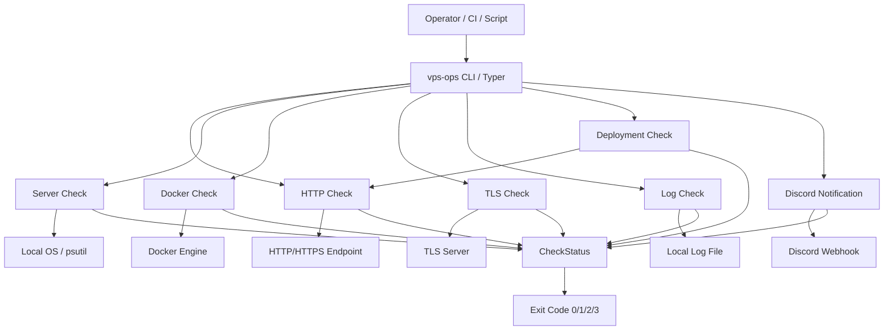
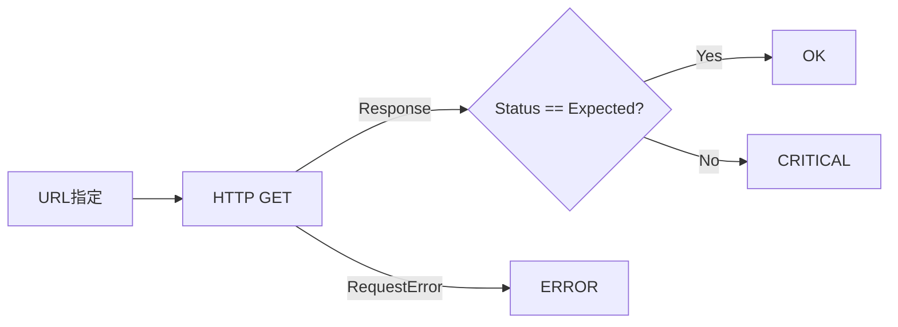
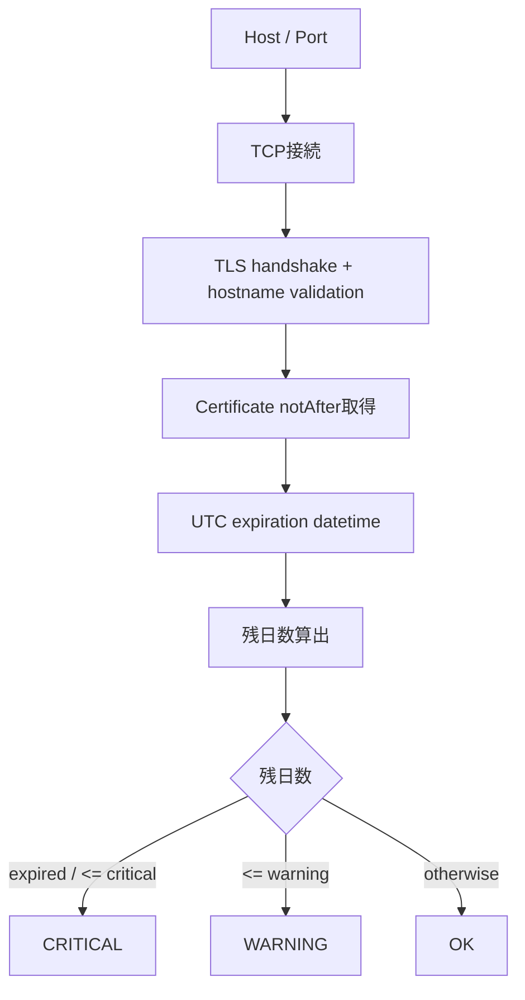
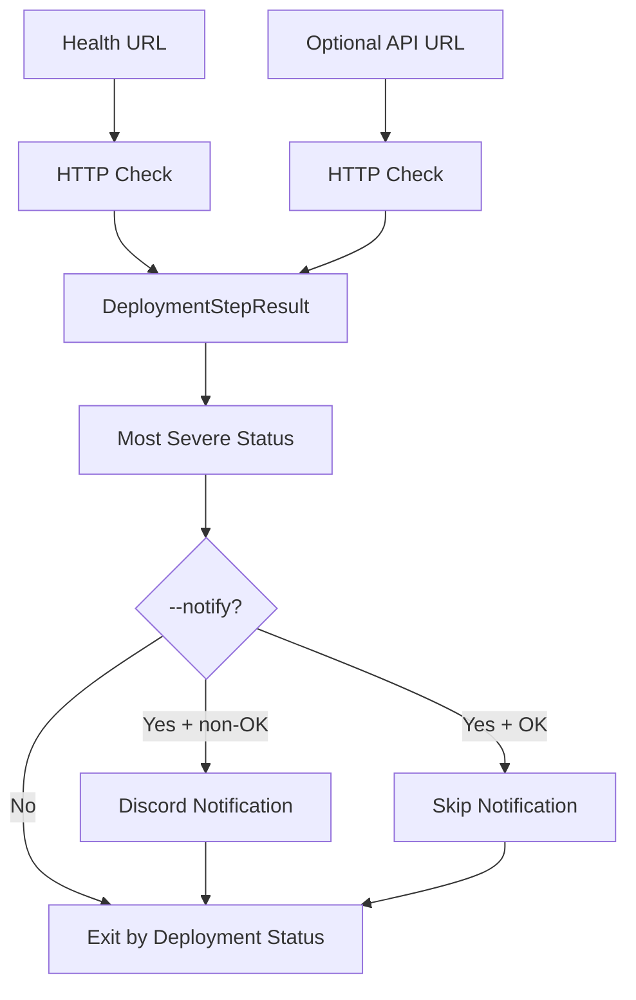
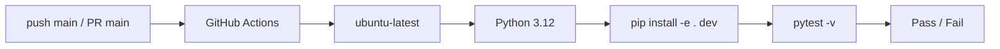

# Python VPS Operations Toolkit 基本設計書

- 文書名: 基本設計書
- 対象: Python VPS Operations Toolkit
- 対象バージョン: 0.1.0
- 作成日: 2026-09-16
- 前提: `01_requirements.md` および現行実装に準拠

---

## 1. 設計方針

本ツールは「監視処理」「CLI 表示・終了コード制御」「通知処理」を分離する。

主な設計方針は以下とする。

1. 各監視機能は Python 関数として独立させる。
2. 監視結果は `CheckStatus` を基準に共通化する。
3. CLI 層は監視関数を呼び出し、Rich で表示して Exit Code へ変換する。
4. Discord 通知は監視ロジックから分離し、CLI 層から必要時のみ呼び出す。
5. Deployment Check は既存の HTTP Health Check を再利用する。
6. 外部サービス依存処理はテスト時に Mock 化できる構造とする。

---

## 2. システム構成



---

## 3. コンポーネント構成

| コンポーネント | ファイル | 責務 |
|---|---|---|
| Common Model | `src/vps_ops_toolkit/models.py` | 共通ステータス、HTTP系共通結果モデル |
| HTTP Check | `checks/http_check.py` | HTTP Status / 応答時間 / 接続エラー判定 |
| Server Check | `checks/server_check.py` | CPU / Memory / Disk / Swap の取得と閾値判定 |
| Docker Check | `checks/docker_check.py` | Docker Engine / Container State / Health 判定 |
| TLS Check | `checks/tls_check.py` | TLS 証明書期限取得・残日数判定 |
| Log Check | `checks/log_check.py` | ログ末尾の ERROR / WARNING 検出 |
| Deployment Check | `checks/deployment_check.py` | Health / API の複合確認 |
| Discord Notification | `notifications/discord.py` | Discord Webhook 通知 |
| CLI | `cli.py` | コマンド、表示、通知制御、Exit Code 変換 |
| Test | `tests/` | 各機能の単体 / CLI 統合テスト |
| CI | `.github/workflows/ci.yml` | GitHub Actions による pytest 実行 |

---

## 4. CLI 基本インターフェース

### 4.1 コマンド一覧

| Command | 必須入力 | 主なオプション | 目的 |
|---|---|---|---|
| `health` | URL | expected-status, timeout | HTTP Endpoint 確認 |
| `server` | なし | warning, critical | Local Server Resource 確認 |
| `docker` | なし | なし | Docker Container 確認 |
| `tls` | HOST | port, warning-days, critical-days, timeout | TLS 証明書期限確認 |
| `logs` | PATH | tail-lines, max-matches | ログ異常検出 |
| `deploy-check` | HEALTH_URL | api-url, expected status, timeout, notify | デプロイ後確認 |
| `notify-test` | なし | timeout | Discord 疎通確認 |

### 4.2 出力方針

- 単一結果は項目形式で表示する。
- 複数結果は Rich `Table` で表示する。
- 最終判定は `Status` または `Overall` として表示する。
- CLI 終了時はステータスに応じた Exit Code を返す。

---

## 5. 共通ステータス設計

### 5.1 ステータス

```text
OK
WARNING
CRITICAL
ERROR
```

### 5.2 意味

| Status | 意味 | 代表例 |
|---|---|---|
| OK | 正常 | HTTP Status 一致、リソース閾値未満 |
| WARNING | 注意 | Resource Warning 閾値超過、Docker Health starting、ログ WARNING |
| CRITICAL | 監視対象異常 | HTTP Status 不一致、Container stopped/unhealthy、ログ ERROR |
| ERROR | チェック処理失敗 | 接続失敗、ファイル読込失敗、Docker Engine エラー |

### 5.3 優先度

```text
OK(0) < WARNING(1) < CRITICAL(2) < ERROR(3)
```

### 5.4 Exit Code

| Status | Exit Code |
|---|---:|
| OK | 0 |
| WARNING | 1 |
| CRITICAL | 2 |
| ERROR | 3 |

---

## 6. 各機能の基本設計

### 6.1 HTTP Health Check

**入力**

- URL
- Expected HTTP Status（default: 200）
- Timeout（default: 5.0 sec）

**処理**



**出力**

- Status
- Message
- Response Time

### 6.2 Server Monitor

**監視対象**

コマンド実行マシン自身。

**監視項目**

- CPU
- Memory
- Disk
- Swap

**既定閾値**

| 使用率 | Status |
|---|---|
| `< 80%` | OK |
| `80% <= value < 90%` | WARNING |
| `>= 90%` | CRITICAL |

4 項目の最重度を Overall とする。

### 6.3 Docker Monitor

Docker SDK for Python から Docker Engine へ接続し、`all=True` で全 Container を取得する。

| State / Health | Status |
|---|---|
| state != running | CRITICAL |
| running + unhealthy | CRITICAL |
| running + starting | WARNING |
| running + healthy | OK |
| running + HEALTHCHECKなし (`none`) | OK |
| Container 0 件 | WARNING |
| Docker 接続失敗 | ERROR |

Container 名でソートして表示を安定化する。

### 6.4 TLS Certificate Monitor



既定値:

- Port: 443
- Warning: 30 days
- Critical: 14 days
- Timeout: 5 sec

### 6.5 Log Monitor

ファイル全体を逐次読込しながら `deque(maxlen=tail_lines)` に直近行のみ保持するため、判定対象は末尾 N 行となる。

- ERROR 系文字列を優先検出する。
- ERROR 1件以上 → CRITICAL
- WARNING のみ → WARNING
- 一致なし → OK
- File read error → ERROR

表示対象の一致ログも `deque(maxlen=max_matches)` により直近 M 件に限定する。

### 6.6 Deployment Check

Health Endpoint は必須、API Endpoint は任意とする。



Discord 通知の結果にかかわらず、最終 Exit Code は Deployment Check の判定を使用する。

### 6.7 Discord Notification

**Webhook URL**

```text
VPS_OPS_DISCORD_WEBHOOK_URL
```

**HTTP 判定**

- 2xx → OK
- 非 2xx → ERROR
- RequestError → ERROR
- URL 未設定 → ERROR

秘密値は Git へ保存しない。

---

## 7. データモデル基本設計

| Model | 主な用途 |
|---|---|
| `CheckStatus` | 全機能共通ステータス |
| `CheckResult` | HTTP / Server の共通結果 |
| `DockerContainerResult` | 1 Container の監視結果 |
| `DockerCheckResult` | Docker 全体結果 |
| `TlsCheckResult` | TLS 監視結果 |
| `LogMatch` | 1 件のログ一致 |
| `LogCheckResult` | Log Monitor 全体結果 |
| `DeploymentStepResult` | Deployment の 1 Endpoint 結果 |
| `DeploymentCheckResult` | Deployment 全体結果 |
| `NotificationResult` | Discord 通知結果 |

永続 DB や設定 DB は使用しない。

---

## 8. 外部 I/F 設計

### 8.1 HTTP / HTTPS

- Method: GET
- 用途: `health`, `deploy-check`
- 成否: 指定 Expected HTTP Status との一致で判定

### 8.2 Docker Engine

- Library: Docker SDK for Python
- Connection: `docker.from_env()`
- Reachability check: `client.ping()`
- Container query: `containers.list(all=True)`

### 8.3 TLS

- Library: Python `ssl`, `socket`
- Context: `ssl.create_default_context()`
- SNI / hostname: `server_hostname=host`

### 8.4 File System

- Log file を UTF-8 で読み込む。
- Decode error は `errors="replace"` とする。

### 8.5 Discord

- HTTP POST
- Payload: `{ "content": message }`
- Webhook URL: 環境変数から取得

---

## 9. エラー設計

| 区分 | 扱い |
|---|---|
| 監視対象の異常 | CRITICAL / WARNING |
| ネットワーク・Docker・File I/O 等の処理失敗 | ERROR |
| CLI 入力値不正 | ValueError を CLI 層で受けて ERROR / Exit 3 |
| Discord 通知失敗 | Notification は ERROR。ただし Deployment 結果を維持 |

---

## 10. セキュリティ設計

- Discord Webhook URL は環境変数からのみ取得する。
- `.env`, `.env.*` は `.gitignore` で除外する。
- `.env.example` はキー名のみ管理する。
- 実 Webhook URL を README / 画像 / Git 管理ファイルへ含めない運用とする。

---

## 11. CI 基本設計



Workflow: `.github/workflows/ci.yml`

現行 CI はテスト実行を目的とし、自動 VPS デプロイは行わない。

---

## 12. 配置・インストール設計

Package は `src` layout を採用し、`pyproject.toml` の console script により `vps-ops` を登録する。

```toml
[project.scripts]
vps-ops = "vps_ops_toolkit.cli:app"
```

標準的な導入手順:

```bash
python3 -m venv .venv
source .venv/bin/activate
python -m pip install --upgrade pip
python -m pip install -e .
vps-ops --help
```

開発環境では `python -m pip install -e ".[dev]"` を使用する。
